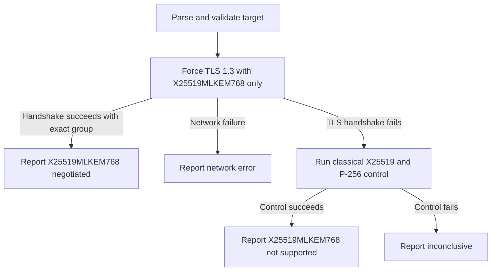

# PQC TLS Checker

A small prototype that checks whether an HTTPS endpoint can negotiate the standardized hybrid TLS 1.3 key-exchange group `X25519MLKEM768`.

The checker uses Go's `crypto/tls` implementation for the TLS handshake, so it can detect `X25519MLKEM768` even when the system OpenSSL version is too old to support it. The Python script provides target parsing, orchestration, result classification, and JSON output.

## What it checks

The primary probe offers **only** `X25519MLKEM768` in a TLS 1.3 handshake. A successful handshake whose negotiated curve is exactly `X25519MLKEM768` confirms support for that group on the tested endpoint.

If the PQC handshake fails, the checker performs a control handshake using the classical `X25519` and `P-256` groups. This helps distinguish an endpoint that does not accept `X25519MLKEM768` from an endpoint with a broader TLS or connectivity problem.

## What it does not check

This tool does not prove that an entire website is quantum-safe. In particular, it does not evaluate:

- Post-quantum certificate signatures
- Certificate validity or hostname verification
- Application-layer encryption
- Every IP address, CDN edge, or geographic region serving the hostname
- TLS behavior of other ports or protocols

The result applies only to the TLS key exchange observed for the tested endpoint and connection.

## Requirements

- Python 3.10 or newer
- Go with `crypto/tls.X25519MLKEM768` support
  - The prototype is tested with Go `1.26.4`
- Outbound TCP access to the target TLS endpoint

OpenSSL 3.5 is **not** required. Stock OpenSSL 3.0 cannot negotiate `X25519MLKEM768`, but the checker does not use OpenSSL for the probe.

No third-party Python or Go packages are required.

## Usage

Run the checker with a hostname:

```bash
python3 check.py example.com
```

Other supported target formats:

```bash
python3 check.py example.com:8443
python3 check.py https://example.com/path
python3 check.py 192.0.2.1
python3 check.py '[2001:db8::1]:443'
python3 check.py bücher.example
```

Override the target port or timeout:

```bash
python3 check.py example.com --port 8443
python3 check.py example.com --timeout 5
```

Display CLI help:

```bash
python3 check.py --help
```

The default target is `cloudflare.com` when no target is supplied.

## Example result

```json
{
  "target": "cloudflare.com",
  "port": 443,
  "pqc_status": "X25519MLKEM768_NEGOTIATED",
  "supports_x25519_mlkem768": true,
  "is_quantum_resistant": true,
  "evaluation": "The endpoint negotiated hybrid X25519MLKEM768 key exchange.",
  "details": {
    "protocol": "TLSv1.3",
    "cipher_suite": "TLS_AES_128_GCM_SHA256",
    "negotiated_group": "X25519MLKEM768",
    "certificate_verified": null,
    "backend": "go-crypto-tls",
    "backend_version": "go1.26.4",
    "error": null
  }
}
```

`is_quantum_resistant` refers only to the observed hybrid key exchange. It must not be interpreted as a claim that every part of the website or its authentication is post-quantum secure.

## Result statuses

| Status | Meaning |
| --- | --- |
| `X25519MLKEM768_NEGOTIATED` | The endpoint completed TLS 1.3 using exactly `X25519MLKEM768`. |
| `X25519MLKEM768_NOT_SUPPORTED` | The PQC handshake failed, but the classical TLS 1.3 control handshake succeeded. |
| `NETWORK_ERROR` | The endpoint could not be reached, so support is unknown. |
| `LOCAL_PROBE_ERROR` | The local Go backend was missing, failed to compile, timed out, or returned an invalid result. |
| `INCONCLUSIVE` | Neither the PQC handshake nor the classical control handshake succeeded. |

For errors and inconclusive results, `supports_x25519_mlkem768` is `null` rather than `false` because the target's capability was not established.

## Target handling

The checker accepts:

- DNS hostnames
- Internationalized hostnames, converted to IDNA
- IPv4 addresses
- Bare IPv6 addresses
- Bracketed IPv6 addresses with a port
- `host:port` pairs
- HTTPS URLs

Only HTTPS URLs are accepted. URL credentials and invalid port numbers are rejected. Paths, queries, and fragments are ignored because the probe tests the TLS endpoint rather than sending an HTTP request.

SNI is sent for DNS hostnames. It is not sent when probing a raw IP address.

## How it works



The Python entry point is `check.py`. It invokes `pqc_probe.go` with `go run`. The Go helper performs the TLS handshake and returns structured JSON containing the negotiated TLS version, cipher suite, and curve ID.

The first execution may take slightly longer while Go compiles and caches the helper.

## Tests

Run the Python unit tests:

```bash
python3 -m unittest -v test_check.py
```

Compile-check the Go probe:

```bash
go test pqc_probe.go
```

Run Go static analysis:

```bash
go vet pqc_probe.go
```

The Python tests use mocked probe results and do not require network access.

## Files

- `check.py` — CLI, target validation, probe orchestration, and result classification
- `pqc_probe.go` — TLS 1.3 probe using Go's `crypto/tls`
- `test_check.py` — target-handling and result-classification unit tests

## Security considerations

The Go probe intentionally disables certificate verification because it is testing key-exchange capability rather than endpoint identity. The output therefore reports `certificate_verified` as `null`.

If this checker is exposed through a web application or API, restrict permitted targets. Allowing arbitrary hostnames, IP addresses, and ports can turn the service into an SSRF or internal-network scanning mechanism.
