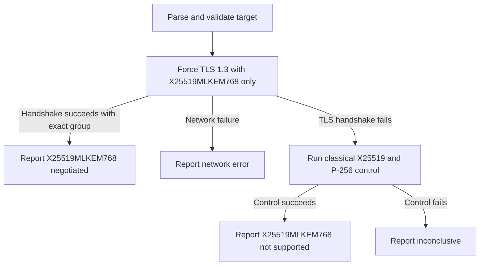

# PQC TLS Checker

A small prototype that checks whether an HTTPS endpoint can negotiate the standardized hybrid TLS 1.3 key-exchange group `X25519MLKEM768`.

The checker uses Go's `crypto/tls` implementation for the TLS handshake, so it can detect `X25519MLKEM768` even when the system OpenSSL version is too old to support it. The Python script provides target parsing, orchestration, result classification, and JSON output.

## What it checks

The primary probe offers **only** `X25519MLKEM768` in a TLS 1.3 handshake. A successful handshake whose negotiated curve is exactly `X25519MLKEM768` confirms support for that group on the tested endpoint.

If the PQC handshake fails, the checker performs a control handshake using the classical `X25519` and `P-256` groups. This helps distinguish an endpoint that does not accept `X25519MLKEM768` from an endpoint with a broader TLS or connectivity problem.

For a successful handshake, the checker inventories each certificate presented by the server and classifies its public-key and signature algorithms as `classical`, `post_quantum`, `hybrid`, or `unknown`. It also derives a conservative classification for the presented chain.

## What it does not check

This tool does not prove that an entire website is quantum-safe. In particular, it does not evaluate:

- Algorithms used by a trust anchor or other certificate not presented by the server
- Certificate validity or hostname verification unless `--verify-certificate` is used
- Application-layer encryption
- Every IP address, CDN edge, or geographic region serving the hostname
- TLS behavior of other ports or protocols

The result applies only to the TLS key exchange observed for the tested endpoint and connection.

## Requirements

- Python 3.10 or newer
- Go with `crypto/tls.X25519MLKEM768` support
  - The prototype is tested with Go `1.26.4`
- Outbound TCP access to the target TLS endpoint

OpenSSL 3.5 is **not** required. Stock OpenSSL 3.0 cannot negotiate `X25519MLKEM768`, but the checker does not use OpenSSL for the probe.

No third-party Python or Go packages are required.

## Usage

Run the checker with a hostname:

```bash
python3 check.py example.com
```

Other supported target formats:

```bash
python3 check.py example.com:8443
python3 check.py https://example.com/path
python3 check.py 192.0.2.1
python3 check.py '[2001:db8::1]:443'
python3 check.py bücher.example
```

Override the target port or timeout:

```bash
python3 check.py example.com --port 8443
python3 check.py example.com --timeout 5
```

Optionally verify the certificate chain and target hostname in a separate TLS handshake:

```bash
python3 check.py example.com --verify-certificate
```

Certificate verification is separate from the key-establishment probe, so an invalid certificate does not hide an otherwise successful `X25519MLKEM768` negotiation.

Display CLI help:

```bash
python3 check.py --help
```

The default target is `cloudflare.com` when no target is supplied.

## Example result

```json
{
  "target": "cloudflare.com",
  "port": 443,
  "pqc_status": "X25519MLKEM768_NEGOTIATED",
  "supports_x25519_mlkem768": true,
  "key_establishment_security": "hybrid_post_quantum",
  "certificate_security": "classical",
  "certificate_analysis": {
    "status": "classified",
    "presented_chain_classification": "classical",
    "certificates": [
      {
        "index": 0,
        "role": "leaf",
        "subject": "CN=cloudflare.com",
        "issuer": "CN=Example CA",
        "public_key_algorithm": "ECDSA",
        "public_key_classification": "classical",
        "signature_algorithm": "ECDSA-SHA256",
        "signature_classification": "classical"
      }
    ]
  },
  "certificate_verification": {
    "requested": false,
    "status": "not_requested",
    "verified": null,
    "hostname_verified": null,
    "error": null
  },
  "is_quantum_resistant": true,
  "evaluation": "The endpoint negotiated hybrid X25519MLKEM768 key exchange.",
  "details": {
    "protocol": "TLSv1.3",
    "cipher_suite": "TLS_AES_128_GCM_SHA256",
    "negotiated_group": "X25519MLKEM768",
    "certificate_verified": null,
    "backend": "go-crypto-tls",
    "backend_version": "go1.26.4",
    "error": null
  }
}
```

`key_establishment_security` describes only the observed TLS key-establishment result. Its possible values are:

| Value | Meaning |
| --- | --- |
| `hybrid_post_quantum` | The endpoint negotiated exactly `X25519MLKEM768`. |
| `target_hybrid_group_not_supported` | Classical TLS 1.3 succeeded after the endpoint rejected the `X25519MLKEM768`-only probe. This does not rule out support for other post-quantum groups. |
| `unknown` | The endpoint's key-establishment capability could not be established. |

`certificate_security` summarizes the public-key and signature algorithm classifications across the certificates presented by the server:

| Value | Meaning |
| --- | --- |
| `classical` | Every observed public-key and signature algorithm is classical. |
| `post_quantum` | Every observed public-key and signature algorithm is post-quantum. |
| `hybrid` | Every observed algorithm is explicitly hybrid. |
| `mixed` | The presented chain contains more than one recognized classification. |
| `unknown` | No certificate information was available or at least one algorithm could not be classified safely. |

`certificate_analysis.certificates` contains the per-certificate public-key and signature classifications. The aggregate applies only to the server-presented chain; TLS servers commonly omit their root certificate. Classification is independent of certificate verification and does not establish trust or validity.

`certificate_verification.status` is one of:

| Value | Meaning |
| --- | --- |
| `not_requested` | Certificate verification was not enabled. |
| `verified` | Go's standard verifier accepted the certificate chain and target hostname. |
| `failed` | Standard certificate verification rejected the certificate. Key-establishment results remain independent. |
| `unavailable` | Verification could not be attempted or the verification handshake failed for a reason other than certificate rejection. |

When verification fails, `hostname_verified` reports whether the leaf certificate matches the target independently of certificate-chain trust when that information is available.

`is_quantum_resistant` is deprecated and retained temporarily for compatibility. It mirrors `supports_x25519_mlkem768`; new integrations should use `supports_x25519_mlkem768`, `key_establishment_security`, and `certificate_security`. No field should be interpreted as a claim that every part of the website is post-quantum secure.

## Result statuses

| Status | Meaning |
| --- | --- |
| `X25519MLKEM768_NEGOTIATED` | The endpoint completed TLS 1.3 using exactly `X25519MLKEM768`. |
| `X25519MLKEM768_NOT_SUPPORTED` | The PQC handshake failed, but the classical TLS 1.3 control handshake succeeded. |
| `NETWORK_ERROR` | The endpoint could not be reached, so support is unknown. |
| `LOCAL_PROBE_ERROR` | The local Go backend was missing, failed to compile, timed out, or returned an invalid result. |
| `INCONCLUSIVE` | Neither the PQC handshake nor the classical control handshake succeeded. |

For errors and inconclusive results, `supports_x25519_mlkem768` is `null` rather than `false` because the target's capability was not established.

## Target handling

The checker accepts:

- DNS hostnames
- Internationalized hostnames, converted to IDNA
- IPv4 addresses
- Bare IPv6 addresses
- Bracketed IPv6 addresses with a port
- `host:port` pairs
- HTTPS URLs

Only HTTPS URLs are accepted. URL credentials and invalid port numbers are rejected. Paths, queries, and fragments are ignored because the probe tests the TLS endpoint rather than sending an HTTP request.

SNI is sent for DNS hostnames. It is not sent when probing a raw IP address.

## How it works



The Python entry point is `check.py`. It invokes `pqc_probe.go` with `go run`. The Go helper performs the TLS handshake and returns structured JSON containing the negotiated TLS version, cipher suite, curve ID, and algorithms used by the server-presented certificates.

The first execution may take slightly longer while Go compiles and caches the helper.

## Tests

Run the Python unit tests:

```bash
python3 -m unittest -v test_check.py
```

Run the Go tests and compile-check the probe:

```bash
go test
```

Run Go static analysis:

```bash
go vet ./...
```

The Python tests use mocked probe results and do not require network access.

## Files

- `check.py` — CLI, target validation, probe orchestration, and result classification
- `go.mod` — dependency-free Go module definition for tests and tooling
- `pqc_probe.go` — TLS 1.3 probe and certificate algorithm inventory using Go's standard library
- `pqc_probe_test.go` — certificate algorithm-classification unit tests
- `test_check.py` — target-handling and result-classification unit tests

## Security considerations

The key-establishment probes intentionally disable certificate verification because they test capability rather than endpoint identity. They still inspect the algorithms in certificates presented during a successful handshake. With `--verify-certificate`, the checker performs a separate handshake using Go's standard certificate-chain and hostname verification. Certificate failure is reported independently and does not overwrite the key-establishment result.

Algorithm classification is conservative. Recognized RSA, DSA, ECDSA, and Ed25519 algorithms are classical; recognized ML-DSA, SLH-DSA, Dilithium, Falcon, and SPHINCS+ names are post-quantum; composite or combined classical/PQ names are hybrid. Unrecognized algorithms are reported as `unknown` rather than assumed secure.

Classification is limited to certificate algorithms that the installed Go `crypto/x509` implementation can parse. If an endpoint uses a PQ certificate unsupported by that Go version, the TLS handshake may fail and certificate classification will be unavailable rather than falsely reported as post-quantum.

If this checker is exposed through a web application or API, restrict permitted targets. Allowing arbitrary hostnames, IP addresses, and ports can turn the service into an SSRF or internal-network scanning mechanism.
